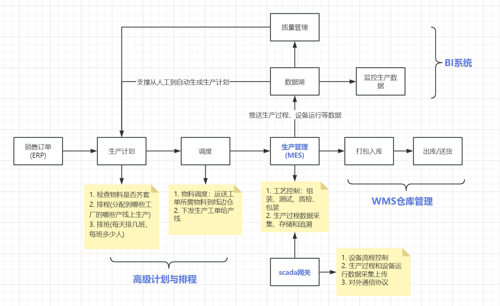

# CloudSilk
云梭（MOM系统），英文名CloudSilk。

## 云梭 是什么？

云梭生产运营管理系统，作为工厂的“智能中枢”，负责精确调度与优化整个生产流程的各个环节。想象一下，一个工厂里有各种各样的机器和工人，他们需要按照一定的顺序和规则来工作，以确保生产出来的产品质量好、效率高。MOM系统就像是这个工厂的“总调度员”，它告诉机器何时开始工作、何时休息，告诉工人下一步该做什么，同时还要确保生产过程中的安全和环保。

这个系统可以帮助工厂的老板和管理者们实时了解生产情况，比如哪些机器在运行、哪些机器需要维护、生产进度如何、产品质量是否达标等等。它还能帮助老板们做出更好的决策，比如根据订单情况调整生产计划，或者优化生产流程以降低成本。

总之，MOM系统就像是一个智能的“管家”，它让工厂的生产更加有序、高效，同时还能确保生产出来的产品质量优良，让工厂的生意越做越好。

## 系统架构设计

## 功能特点

- **MES（Manufacturing Execution System）生产执行系统** - 是专门为制造业设计的一种计算机系统，它位于企业信息技术架构的中间层，连接了企业的管理层（如ERP系统）和工厂的现场控制层（如SCADA系统）。MES系统的主要目的是实时监控和控制生产过程，确保生产计划的执行，并优化生产活动。
- **APS（Advanced Planning and Scheduling）高级计划和排程系统** - 是一种基于先进算法和技术的软件工具，用于帮助企业优化其生产计划和排程过程。APS系统通常作为企业资源规划（ERP）系统的一个补充，专注于生产调度和详细的排程任务，以确保生产活动能够高效、及时地完成。
- **WMS（Warehouse Management System）仓库管理系统** - 是一种用于优化仓库运作的软件解决方案。它通过实时监控和指导仓库的日常操作，帮助企业提高仓库效率、减少错误、降低成本，并提供更好的客户服务。
- **SCADA（Supervisory Control and Data Acquisition）网关** - 是一种硬件和/或软件解决方案，它充当了生产执行系统（MES）和设备之间的桥梁。SCADA网关的主要作用是收集来自各种工业设备和传感器的数据，并将这些数据转换为可以用于监控和控制的信息。
- **质量管理系统** - 通过实时监控和控制生产过程中的质量指标，确保产品质量符合标准要求。
- **设备管理系统** - 跟踪和管理生产设备的状态、性能和维护，确保设备的正常运行和生产效率。

## 功能模块

## 技术架构

- **后端开发语言：** 采用Golang，利用其高性能、简洁的特点，保证了系统的高效稳定运行。
- **前端框架：** 使用React，结合Ant Design UI组件库和Formily表单解决方案，实现了快速构建高质量表单和复杂交互的功能。
- **服务调用：** 采用Dubbo的Go语言实现——dubbogo，结合Nacos作为服务注册与发现中心，实现了微服务架构下的服务治理。
- **数据存储：** 选用MySQL数据库，通过其稳定可靠的性能，保证了数据的安全性和一致性。
- **微服务架构：** 将系统拆分成多个小型、独立的服务，提高了系统的可扩展性和可维护性。
- **服务治理：** 使用Nacos进行服务注册与发现，实现了服务之间的解耦和动态扩展。
- **前后端分离：** 采用前后端分离的设计模式，提高了开发效率和系统的可维护性。
- **高效稳定：** 通过选用高性能的编程语言和框架，保证了系统的高效稳定运行。
- **易扩展和易维护：** 采用微服务架构，使得系统具有更好的可扩展性和可维护性。
