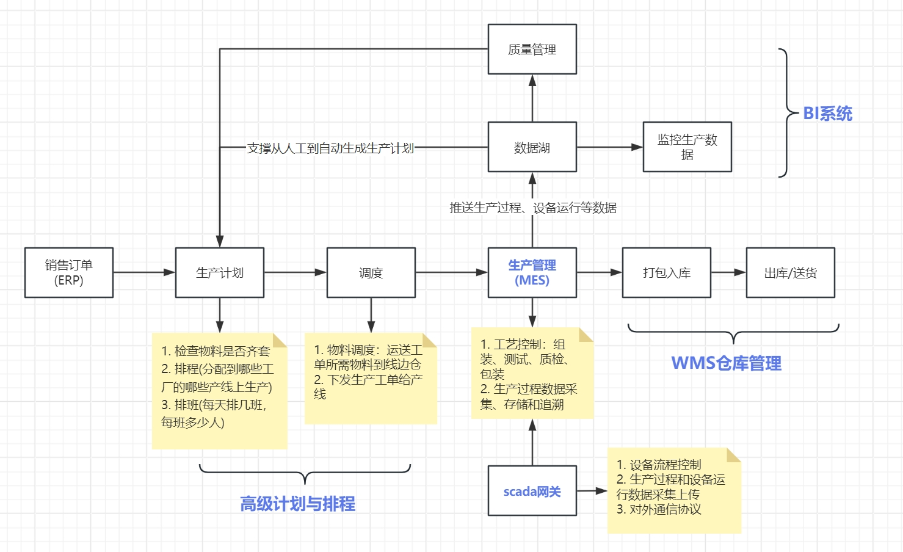

# CloudSilk (云梭)

[](./LICENSE)
[](https://go.dev)
[](./CONTRIBUTING.md)

[Discord](https://discord.gg/AXgZhNPv) | [Deployment](./docs/DEPLOYMENT.md) | [Contributing](./CONTRIBUTING.md) | [Roadmap & Tasks](./TASKS.md) | [中文介绍](#中文介绍)

---

## What is CloudSilk?

**CloudSilk** (云梭) is an open-source **MOM (Manufacturing Operations Management)** system — the "smart hub" of a factory. It schedules and optimizes every step of the production process: telling machines when to run, telling operators what to do next, tracking quality and output in real time, and giving managers the data they need to make better decisions.

It sits between the enterprise layer (ERP) and the shop-floor control layer (SCADA/PLC), connecting business orders to actual execution on production lines.

### Architecture

```
                    ┌─────────────────────────────────────────────────┐
                    │              Web UI  (React + AntD)              │
                    │   low-code CRUD pages · form designer · BPM      │
                    └────────────────────────┬────────────────────────┘
                                             │ HTTP / JSON
┌────────────────────────────────────────────▼────────────────────────────────────┐
│                          CloudSilk Server (Go / Gin)                             │
│                                                                                  │
│   ┌────────────────┐  ┌──────────────────────┐  ┌─────────────────────────────┐ │
│   │   usercenter   │  │       curd           │  │         MOM domain          │ │
│   │ auth · RBAC ·  │  │ low-code metadata    │  │ ┌─────────────────────────┐ │ │
│   │ tenant · token │  │ engine · dynamic     │  │ │ MES 生产执行             │ │ │
│   └────────────────┘  │ forms & pages        │  │ │  order · process route  │ │ │
│                       └──────────────────────┘  │ │  station in/out · work  │ │ │
│   ┌─────────────────────────────────────────┐   │ │  records · rework       │ │ │
│   │      WebAPI (shop-floor devices)        │   │ ├─────────────────────────┤ │ │
│   │  online · enter/exit station · report   │   │ │ MSS 物料/仓储            │ │ │
│   └─────────────────────────────────────────┘   │ │  store · shelf · bin    │ │ │
│                                                 │ │  inventory · container  │ │ │
│   ┌─────────────────────────────────────────┐   │ │  AGV task queue         │ │ │
│   │      Label Print Service (C#, optional) │   │ ├─────────────────────────┤ │ │
│   │      BarTender templates · MQTT         │   │ │ Label · Trace · System  │ │ │
│   └─────────────────────────────────────────┘   │ └─────────────────────────┘ │ │
│                                                 └─────────────────────────────┘ │
└──────────┬──────────────────────────────────────────────────────┬───────────────┘
           │                                                      │
┌──────────▼───────────┐                          ┌───────────────▼───────────────┐
│   MySQL / SQLite     │                          │  Nacos (optional)             │
│   via GORM           │                          │  service registry for         │
└──────────────────────┘                          │  dubbo-go microservice mode   │
                                                  └───────────────────────────────┘

Planned (see Roadmap):  APS scheduling ─ ─ SCADA gateway ─ ─ Equipment management ─ ─ QM
```

### Module status

| Module | Status | Highlights |
|--------|--------|-----------|
| MES 生产执行 | ✅ Maintained | 工单、工艺路线、进/出站、报工、返工、工位节拍 |
| MSS 物料/仓储 | ✅ Maintained | 仓库/货架/库位、库存、容器、AGV 任务队列、退料单 |
| Label 标签打印 | ✅ Maintained | 标签模板/类型、打印队列、C# BarTender 打印服务 |
| Traceability 追溯 | ✅ Maintained | 操作/调用/异常追溯，人员资质 |
| Low-code platform | ✅ Maintained | curd 元数据引擎、动态表单/页面、BPM 设计器 |
| Auth 用户中心 | ✅ Maintained | [usercenter](https://github.com/CloudSilk/usercenter)：认证、RBAC、多租户 |
| QM 质量管理 | 🚧 Partial | 测试记录落库；检验单/SPC/质量看板开发中 |
| APS 高级排程 | 📋 Planned | 排程引擎、甘特图、产能平衡 |
| SCADA 网关 | 📋 Planned | Modbus/OPC UA 采集、点位管理 |
| EM 设备管理 | 📋 Planned | 设备台账、维保计划、OEE |

### Quick Start

**Prerequisites:** Go 1.20+ (Node.js 18+ only when rebuilding the web UI). Or just use Docker.

```bash
# ── Option A: Docker (recommended) ─────────────────────────────
docker build -t cloudsilk/mom .
docker run -d --name cloudsilk -p 20000:20000 cloudsilk/mom
# open http://localhost:20000/web   (default password: CloudSilk, see config.yaml → defaultPwd)

# ── Option B: From source (single binary, embedded SQLite) ────
go build -o CloudSilk main.go
./CloudSilk --ui ./web/dist --service_mode=ALL --single_db=true --port=48900

# ── Web UI development ─────────────────────────────────────────
cd web && WEB_BASE=/web yarn install && WEB_BASE=/web yarn start
```

See [docs/DEPLOYMENT.md](./docs/DEPLOYMENT.md) for production deployment (MySQL, Nacos, microservice mode via dubbo-go) and troubleshooting.

### Tech stack

- **Backend:** Golang, Gin, GORM (MySQL / SQLite), dubbo-go + Nacos for optional microservice mode
- **Frontend:** React, Ant Design, Formily, umi — business pages are rendered dynamically from metadata ([SwiftEase](https://github.com/CloudSilk/SwiftEase) low-code platform)
- **Printing:** C# label service built on Seagull BarTender, MQTT task dispatch

### Roadmap

The full backlog with priorities lives in [TASKS.md](./TASKS.md). Highlights:

- **Short term:** fix station-dashboard & test-report APIs, order dispatch step, duplicate-report dedup
- **Mid term:** quality management (inspection orders, SPC), production monitoring dashboards
- **Long term:** APS scheduling engine, SCADA gateway (Modbus/OPC UA), equipment management

### Contributing

Issues and pull requests are welcome — and actively triaged. See [CONTRIBUTING.md](./CONTRIBUTING.md) for the workflow, code style, and commit conventions.

## License

[Apache 2.0](./LICENSE)

---

# 中文介绍

[Discord](https://discord.gg/AXgZhNPv)

云梭（MOM系统），英文名CloudSilk。

## 云梭 是什么？

云梭生产运营管理系统，作为工厂的“智能中枢”，负责精确调度与优化整个生产流程的各个环节。想象一下，一个工厂里有各种各样的机器和工人，他们需要按照一定的顺序和规则来工作，以确保生产出来的产品质量好、效率高。MOM系统就像是这个工厂的“总调度员”，它告诉机器何时开始工作、何时休息，告诉工人下一步该做什么，同时还要确保生产过程中的安全和环保。

这个系统可以帮助工厂的老板和管理者们实时了解生产情况，比如哪些机器在运行、哪些机器需要维护、生产进度如何、产品质量是否达标等等。它还能帮助老板们做出更好的决策，比如根据订单情况调整生产计划，或者优化生产流程以降低成本。

总之，MOM系统就像是一个智能的“管家”，它让工厂的生产更加有序、高效，同时还能确保生产出来的产品质量优良，让工厂的生意越做越好。

## 快速开始

```bash
# Docker 方式（推荐）
docker build -t cloudsilk/mom .
docker run -d --name cloudsilk -p 20000:20000 cloudsilk/mom
# 浏览器打开 http://localhost:20000/web（默认密码见 config.yaml → defaultPwd）

# 源码方式（单进程 + SQLite，开箱即用）
go build -o CloudSilk main.go
./CloudSilk --ui ./web/dist --service_mode=ALL --single_db=true --port=48900

# 前端开发
cd web && WEB_BASE=/web yarn install && WEB_BASE=/web yarn start
```

详细部署说明（MySQL、Nacos、微服务模式）见 [docs/DEPLOYMENT.md](./docs/DEPLOYMENT.md)。

## 系统架构设计



英文版架构图与模块状态表见 [Architecture](#architecture)。

## 技术架构

- **后端开发语言：** 采用Golang，利用其高性能、简洁的特点，保证了系统的高效稳定运行。
- **前端框架：** 使用React，结合Ant Design UI组件库和Formily表单解决方案，实现了快速构建高质量表单和复杂交互的功能。
- **服务调用：** 采用Dubbo的Go语言实现——dubbogo，结合Nacos作为服务注册与发现中心，实现了微服务架构下的服务治理。
- **数据存储：** 选用MySQL数据库，通过其稳定可靠的性能，保证了数据的安全性和一致性。
- **微服务架构：** 将系统拆分成多个小型、独立的服务，提高了系统的可扩展性和可维护性。
- **服务治理：** 使用Nacos进行服务注册与发现，实现了服务之间的解耦和动态扩展。
- **前后端分离：** 采用前后端分离的设计模式，提高了开发效率和系统的可维护性。

## 路线图与维护状态

- **正在维护的模块**：MES 生产执行、MSS 物料/仓储、标签打印、追溯、低代码平台（配合 [usercenter](https://github.com/CloudSilk/usercenter) 用户中心）
- **规划中的模块**：质量管理（检验单/SPC）、APS 高级排程、SCADA 网关（Modbus/OPC UA）、设备管理

完整任务清单与优先级见 [TASKS.md](./TASKS.md)，欢迎认领。

## 参与贡献

Issue 和 PR 都会被认真处理，参与方式见 [CONTRIBUTING.md](./CONTRIBUTING.md)。

## 截图


## 社区

如果微信群二维码过期，请添加社区助手的微信，备注云梭。


